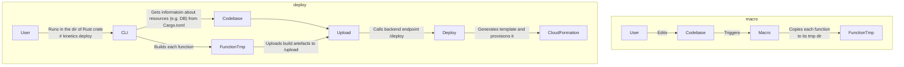

# Intro
Kinetics is a work-in-progress project that aims to provide a simple way to deploy Rust functions to the cloud. In essence it is a macro takes a Rust function and deploys it as AWS Lambda.

# Processes diagrams


# Current state
- [x] Deploy a function to bare-bones AWS Lambda.
- [x] FunctionURL.
- [x] Queue worker.
- [x] Provision SQL DB (DSQL).
- [x] DynamoDB.
- [x] Custom domain for FunctionURL.
- [ ] Login.
- [ ] User sessions.

# How to run the example
1. Create `$HOME/.kinetics/` directory.
1. Clone the repository.
1. Install [Cargo Lambda](https://www.cargo-lambda.info/guide/getting-started.html#step-1-install-cargo-lambda).
1. Clone the repository.
```bash
git clone https://github.com/ottofeller/kinetics.git
```
4. Build `macro` crate.
```bash
cd macro
cargo build
```
5. Build `cli` crate.
```bash
cd cli
cargo build
```
6. Open `example/src/main.rs`, add some insignificant changes (e.g. a comment) and save the file. It will trigger the macro to process the file.
7. Deploy to AWS.
```bash
aws-vault exec <profile name> --no-session -- ../cli/target/debug/cli deploy
```
