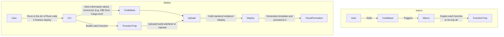

# Intro

Sky is a work-in-progress project that aims to provide a simple way to deploy Rust functions to the cloud. In essence it
is a macro takes a Rust function and deploys it as AWS Lambda.

# Processes diagrams



# Current state

- [x] Deploy a function to bare-bones AWS Lambda.
- [x] FunctionURL.
- [x] Queue worker.
- [x] Provision SQL DB (DSQL).
- [x] DynamoDB.
- [x] Custom domain for FunctionURL.
- [ ] Login.
- [ ] User sessions.

# Deploy backend into your AWS account

## Build CLI tool

```shell
cargo build --release --bin kinetics-cli
```

### Export required env variables

```shell
export KINETICS_USE_PRODUCTION_DOMAIN="false" &&\
export KINETICS_USERNAME="your-email@domain.com" &&\
export KINETICS_USERNAME_ESCAPED="yourEmailAtDomainDotCom" &&\
export KINETICS_S3_BUCKET_NAME="your-created-bucket-name" &&\
export KINETICS_KMS_KEY_ID="your-kms-ssm-key-id"
```

Get KMS key from AWS console > AWS managed keys > aws/ssm

### Deploy backend

In the backend directory run:

```shell
../target/release/kinetics-cli deploy --is-directly
```

### Get cloudfront domain name

Now you need to get create cloudfront:

```shell
aws cloudfront list-distributions --query "DistributionList.Items[*].[DomainName,Status,LastModifiedTime]"
```

### Export Cloudfront Domain name with KINETICS_API_BASE

```shell
export KINETICS_API_BASE="https://<subdomain>.cloudfront.net/"
```

⚠️ Don't forget trailing slash

### Deploy example using your backend (optional)

⚠️ Before starting, make sure you've built the CLI tool with the required environment variables described above.
Change directory to example and run command:

1. Login to Kinetics platform
    ```shell
    ../target/release/kinetics-cli login your-email@domain.com
    ```
2. Run deployment
    ```shell
    ../target/release/kinetics-cli deploy 
    ```
