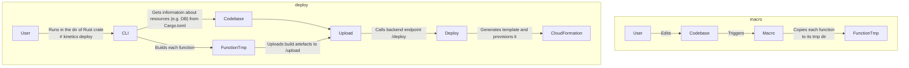

# Intro

Sky is a work-in-progress project that aims to provide a simple way to deploy Rust functions to the cloud. In essence it
is a macro takes a Rust function and deploys it as AWS Lambda.

# Processes diagrams



# Current state

- [x] Deploy a function to bare-bones AWS Lambda.
- [x] FunctionURL.
- [x] Queue worker.
- [x] Provision SQL DB (DSQL).
- [x] DynamoDB.
- [x] Custom domain for FunctionURL.
- [ ] Login.
- [ ] User sessions.

# Deploy backend into your AWS account

### Initialize environment and deploy backend

Run the script and enter your email:

```shell
./bin/init-local.sh
```

The script will create `./backend/local.env` which you'll be needed for deploying

### Deploy example using your backend (optional)

⚠️ Before starting, make sure you've run `./bin/init-local.sh` before.

1. Use environment variables
    ```shell
    source ./backend/local.env  
    ```       

2. Change directory to `examples`

1. Login to Kinetics platform
    ```shell
    cargo run -p kinetics-cli login your-email@domain.com
    ```
2. Run deployment
    ```shell
    cargo run -p kinetics-cli deploy 
    ```
